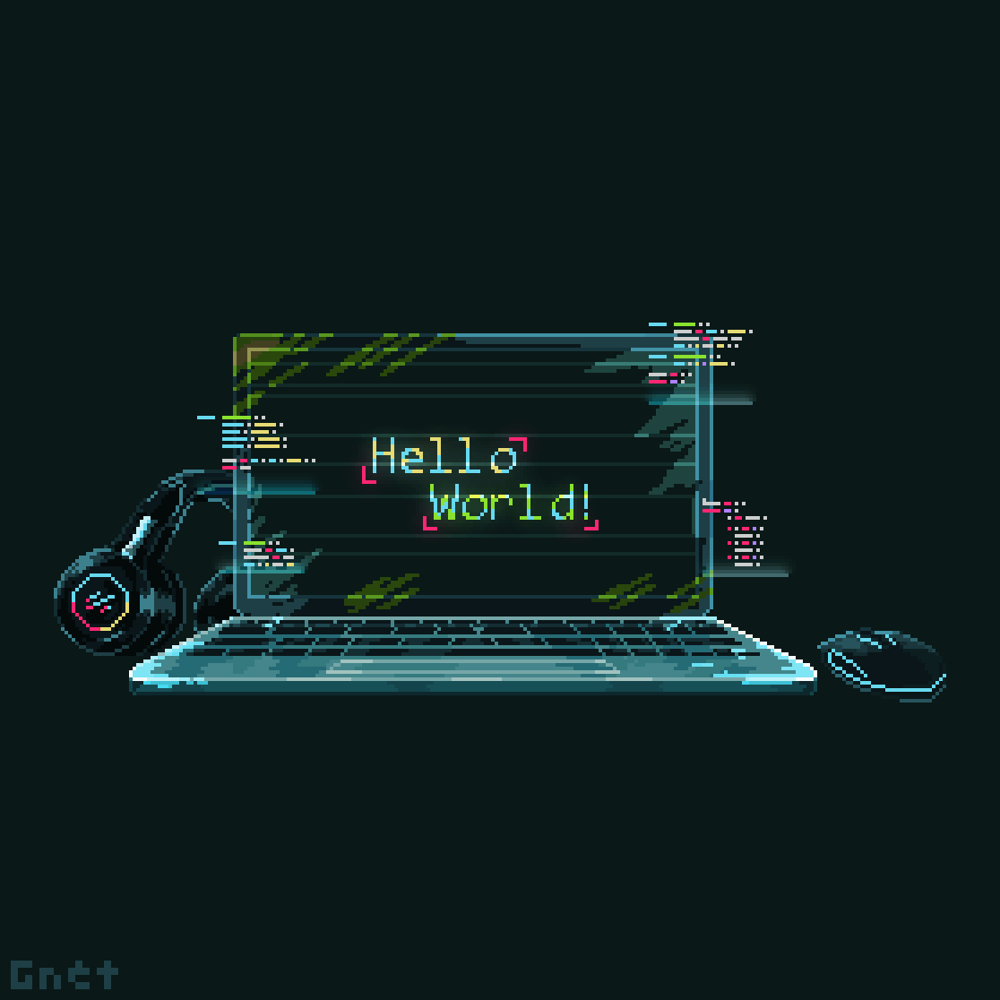

  
  ### ⚙️ Desarrollador Full Stack || Backend-focused

Soy un desarrollador con experiencia en la creación de aplicaciones robustas usando el ecosistema PHP/Laravel y en la integración de sistemas mediante APIs REST. Me centro en soluciones eficientes y escalables.
     

   ### 🚀💻 Stack de Tecnologías
  
#### 💡 Lenguajes
 

&nbsp;

&nbsp;

&nbsp;

&nbsp;
 
&nbsp;

#### 🛠️ Frameworks & Librerías
 

&nbsp;

&nbsp;

&nbsp;

#### 🗃️ Bases de Datos
 

&nbsp;

&nbsp;

 
    
  - Actualmente explorando nuevas ideas para mi próximo proyecto.
     
